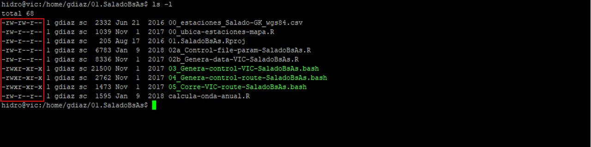

# uso-servidor-VIC-SMN

# Buenas prácticas para el uso del Servidor VIC del Servicio Meteorológico Nacional (SMN)

## Almacenamiento en VIC
El Servidor VIC es un procesador para la generación de productos y servicios de la Dirección de Servicios Sectoriales (DSS) del SMN. Se encuentra instalado en un entorno Linux, distribución Ubuntu. El mismo cuenta con dos lugares de almacenado principales: */home* y */data*, y dos secundarios: */ms-36* y */ms-270*.

### /home
En el */home* se almacenan las carpetas de los distintos usuarios que se encuentran generados en el servidor, por ejemplo: **agro**, **hidro**, **ebontempi**, **cbolzi**, **lferreira**, etc. Debido a que el espacio en */home* es muy limitado, cuenta con un total de espacio de 9.8GB, el objetivo de este lugar es NO almacenar archivos muy pesados. Por lo tanto, está pensado para almacenar cosas livianas, como por ejemplo: scripts de lenguajes de programación, algún pequeño archivo de metadatos, etc.

### /data
En el */data* se almacenan archivos necesarios para ejecutar los scripts que se encuentren en */home* y debido a que es un lugar con un mayor almacenamiento (pero tampoco tan grande) pueden ubicarse ahí archivos más pesados. Por ejemplo: archivos de datos, archivos de parámetros para modelos, etc. El espacio total de */data* es de 1.5TB.

### /ms-36 y /ms-270
Por otro lado, el Servidor VIC cuenta con acceso a otros lugares de almacenamiento más importantes, como son el */ms-36* y el */ms-270*. Respectivamente, en total, ambos tienen aproximadamente 36TB y 270TB de espacio. Por lo tanto, aquí también podrían almacenarse archivos más grandes. Dentro de */ms-36* se encuentra una carpeta */hidro* en donde también se guardan varios archivos shp para su utilización en gráficos o proyectos. Por lo tanto, además de archivos de datos y de parámetros, también podría utilizarse el */ms-36* como un lugar para almacenar archivos estáticos (contornos de provincias, cuencas, etc.). Inicialmente, el */ms-270* no es utilizado como un lugar de almacenamiento en la DSS.

## Instalación de librerías en R
Entre algunos de los software de lenguaje de programación en VIC, se encuentra R (https://www.r-project.org). Es muy habitual el uso de librerías o paquetes en R que se van instalando a medida de la necesidad del usuario. Debido a que por DEFAULT, cuando uno instala una librería en R, esta es instalada en el */home* del usuario, es necesario indicarle a R que la librería no sea instalada ahí (ya que esto podría producir que colapse el almacenamiento en */home*).

Para llevar a cabo esto, cuando se instala la librería por línea de comando, se debe indicar a través del parámetro **lib**, donde instalar la librería. Un ejemplo para instalar el paquete 'lubridate', por línea de comando, sería el siguiente:

```{r echo = FALSE}
install.packages("lubridate", lib = "/data/R-libs/x86_64-pc-linux-gnu-library/3.4")
```

Notar que, el lugar que debe indicarse para instalar la librería o paquete es en una posición alojada en */data*.

## *Levantar* librería en R desde */data*
En la sección anterior se abarcó el tema de como instalar una librería o paquete en R en una ruta específica. Ahora, para poder *levantar* o *abrir* una librería previamente instalada en la ruta específica, es cuestión de indicarle esta ruta a través del parámetro **lib.loc** de la función library.

Entonces, la forma de levantar la librería "lubridate" desde la ruta ubicada en */data*, sería de la siguiente manera:

```{r echo = FALSE}
library("lubridate", lib.loc = "/data/R-libs/x86_64-pc-linux-gnu-library/3.4")
```
Notar que algunos paquetes específicos de R a veces pueden ser levantados únicamente con la función require. Siempre es bueno intentar primero con library y si esto no funciona, probar con require.

## Sobre los usuarios de VIC y los permisos - Primera parte
En esta sección se va a intentar mostrar, de la mejor forma posible, como funciona el tema de usuarios y permisos dentro del Servidor VIC. Como se comentó en una sección anterior, en VIC *conviven* varios usuarios. Hasta el día de hoy, de todos los usuarios que existen, nos importan los siguientes:
* agro       --> Usuario **agro**, general para los usuarios involucrados de ex Agrometeorología (ahora DSS-Agro)
* cbolzi     --> Usuario de Cari Bolzi
* ebontempi  --> Usuario de Euge Bontempi 
* gdiaz      --> Usuario de Gonza Díaz
* hidro      --> Usuario **hidro**, general para los usuarios involucrados de ex Hidrometeorología (ahora DSS-Hidro)
* lferreira  --> Usuario de Lore Ferreira
* mvita      --> Usuario de Maxi Vita (externo al SMN)
* sgimenez   --> Usuario de Santi Gimenez (ex integrante del CIM, ahora externo al SMN, creo que no se utiliza para correr ningún proceso)
* srossi     --> Usuario de Sol Rossi (ya quedó obsoleto, aunque creo que se sigue utilizando para algunos procesos)

Cada uno de estos usuarios cuenta con su */home* propio (como vimos en la sección de */home*), es decir, existe un */home/ebontempi*, un */home/cbolzi*, etc. Este espacio del */home* de cada uno es el que debemos mantener limitado (por contar solo con 9.8GB de almacenamiento), como se mencionó en la sección de */home*.

Cada usuario puede crear carpetas, archivos de texto, scripts de distintos lenguajes de programación, etc. Lo que hay que tener presente es que, por cada carpeta, archivo, script que genere un usuario en particular, se define un tipo y un nivel de permisos sobre ese objeto creado. Los **tipos de permisos** son 3: lectura (r, por su inicial en inglés, read), escritura (w, por su inicial en inglés, write) y ejecución (x por una de sus letras en inglés, execution). Mientras que, los **niveles de permisos** son 3 también: usuario propietario del objeto (UPO), usuario grupo del objeto (UGO) y usuarios otros (USOS). Por lo tanto, para cada objeto, es decir, para cada carpeta, archivo, script, etc. se tendrá definido los 3 **tipos de permisos** para los 3 **niveles de permisos**.

## Sobre los usuarios de VIC y los permisos - Segunda parte
A continuación se muestra una ubicación en VIC, específicamente en */home/gdiaz/01.SaladoBsAs* en donde se encuentran algunos archivos: 1 archivo csv, 1 archivo de proyecto R (.Rproj), 4 scripts de R (.R) y 3 scripts de bash (.bash) y en un recuadro rojo se indican los tipos y niveles de permisos para cada uno de esos archivos.



Es decir, la primera posición define el tipo de archivo, suele aparecer una **d** para indicar que es un directorio/carpeta si no aparece un **-**. Luego, las siguientes tres posiciones indican los **tipos de permisos** para el UPO, las siguientes tres posiciones son los **tipos de permisos** para el UGO y por último, las últimas tres son para el USOS. Además, los nombres que aparecen luego del **1**, en el caso de la figura son *gdiaz* y *sc*, indican quien es el UPO y el UGO del archivo, respectivamente.

Tomemos de ejemplo de la imagen el archivo *03_Genera-control-VIC-SaladoBsAs.bash*, este es un archivo y no una carpeta ya que no cuenta con el indicativo **d** adelante. Luego, aparecen **rwx** que indica que el UPO tiene tanto permisos de lectura (r) como de escritura (w) y ejecución (x). Finalmente, UGO y USOS muestran que solo tienen permisos de lectura y ejecución (**r-x**, por duplicado).

Para finalizar esta sección, los usuarios que pertenecen a un mismo grupo se convierten en UGO. Es decir, los usuarios **hidro** y **agro** de VIC podrían pertenecer a un mismo grupo (llamémoslo grupo *sc*) y por lo tanto, solo basta con darles **tipos de permisos** para nivel UGO y no debería haber problema en que tanto **hidro** y **agro** hagan las modificaciones indicadas en los archivos específicos.

## Sobre los usuarios de VIC y los permisos - Tercera parte
En esta sección indicaremos como saber a que grupo pertenece cada usuario. Simplemente, ejecutando *groups <nombre de usuario>* desde una consola de Linux, podrán saber a que grupo pertenece ese usuario y cual es el orden de prioridad de los mismos.
  

 
